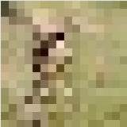
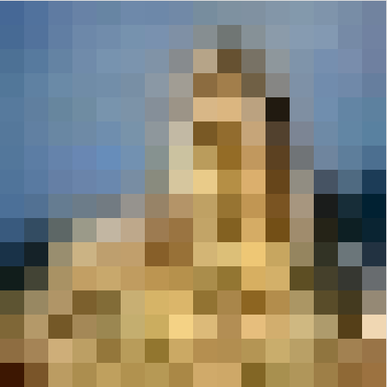
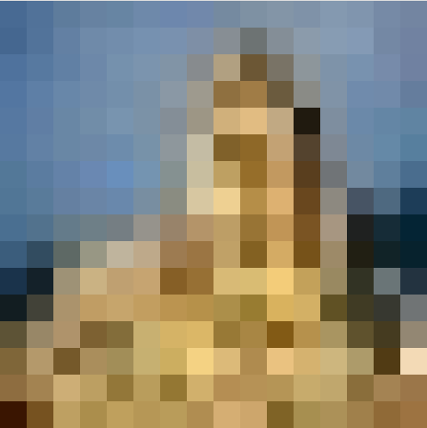
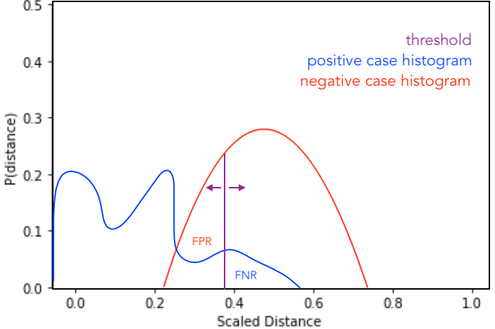

to run:

    git clone https://github.com/richDsInterview/tc.git
    cd tc
    virtualenv venv
    source venv/bin/activate
    pip install -r requirements.txt
  
then
python tc.py <test_image> <database_dir> <method|exact/scaled/phash> 

    python tc.py ../Data_Science_Images/Test/test_image6.jpeg ../Data_Science_Images/Training exact

# Technical Challenge
## SARAO Data Science Technical Challenge

_In this technical challenge we want to test for basic skills such as python coding, ability to handle data and reuse open-source code etc., but also to explore more intangible skills such as flexibility, creativity, independence, communication, ability to relearn and teach yourself, ability to implement ideas, ability to solve challenging problems and to scale them to handle large volumes of data._

## QUESTIONS

### Exact image repetition

__For the first question your goal is to write a python function to determine whether a test image is identical to any image in the Training directory of images. In addition to working code please outline your algorithm and briefly discuss its potential limitations and how you might speed it up.__

Option 1: directly compare the byte values of each image file in the Testing directory to the target image, and print the boolean response to the command line.
Option 2: convert the image files to an array (numpy) in memory and perform pixel-by-pixel comparison.

#### Considerations andLimitations:
* for the binary comparison to succeed, the files must be precisely the same; one is unable with this approach to determine similarity of images if they are of different file formats, even the same class of file format, even if the images are otherwise identical in all respects.
* the numpy representation (`bit map' comparison) is marginally better, in that it could be possible to correctly identify copies from two different image files if their ipython representations are the same.
* any image modification, such as rotations, translations, blurring, the addition of noise, scaling, and cropping will result in failure of direct comparison.
 
 When invoked with arguments pointing to the test image and database directory respectively and the method keyword "exact", the python script tc.py, will return if the numpy representations of the two images exactly match. If there is a match, the image will not be added to the Training directory.

    python tc.py infile dbDir exact
    
    python3 tc.py Data_Science_Images/Test/test_image7.jpg Data_Science_Images/Training/
    No match found. Adding test_image7.jpg to database directory,

 #### Speed Considerations:
* this method is not optimised for speed in any way. For faster execution, especially of for loops, one could, for example:
    * port the script to one of the Python C-wrapped numerical packages (CPython/Cython/etc) 
    * unroll inner loops wherever possible, especially for large images
    * reduce the image dimensions: pre-process, and efficiently-store the database images. For instance, in the second question, I implement a method for computing scaled, uniform 16x16 pixel 'postage-stamp' representations of the image maps that can be precomputed and stored in a database, affording faster comparison of multiple images.
    * use an efficient data structure for storage of image representations. BK-trees group objects by their Hamming-distance, the number of bits different between adjacent elements. Once 'hashed' (having the hash function map computed) a new image would be very efficiently compared to potential nearby image hashes, and rejected faster (O(n_log_N)).

### Image repetition with resizing

__We next want to check if a new test image is the same as any of the training data, but this time allowing for possible resizing of the test image (you may assume the aspect ratio of the two images is the same if they have been resized). Write a python function to solve this problem and briefly describe your solution.__

In order to compare two scaled versions of an identical image, we scale both to a common grid of an appropriate dimension and directly compare the scaled representations.

Grid size: there are various options for the grid size: one could decide to use the size of the smaller image as the reference size, or arguably preferably*, determine some global grid size to which all images are scaled for comparison.

_*(the global grid approach is preferable because it will afford the ability to pre-compute and store a database of 'thumbnail' images. It will have a predictable/bounded computation time, and also more predictable results between arbitrarily-sized input images)_

Nearness: aliasing effects due to resizing are likely to change the pixel values slightly for identical, scaled images, so ideally a nearness function and appropriate threshold should be determined, rather than exact pixel comparison.

Require: 
+ robust scaling method that returns an in-memory array of fixed gridsize
+ nearness function that returns a value that represents the global pixel nearness of two fixed-size images

Issues: 
+ while this approach can deal with scaling, other image modifications (rotations, translations, blurring, the addition of noise, scaling, cropping) are not dealt with.

When invoked with arguments pointing to the test image and database directory respectively, and the method keyword "scaled", the python script tc.py will return if any of the database images is a scaled replica of the test image, even if it has been rescaled multiply, introducing aliasing effects. If it is a replica to within a threshold value, the image will not be added to the Training directory.

    python3 tc.py Data_Science_Images/Test/test_image4.jpg Data_Science_Images/Training/ scaled
    Matching image found in database directory:  training_image3.jpg  (score:  1.0 )
    Match(es) found. Not adding

and
    
    python3 tc.py Data_Science_Images/Test/test_image6.jpeg Data_Science_Images/Training/
    No match found. Adding test_image6.jpeg to database directory.

## Further Thoughts about Scaling
It is a problem that bitwise comparison of a sample image ("test_image9.jpg", shown below) to a scaled and rescaled version of itself ("test_image9_scaled_unscaled.jpg", shown below that) yields a dismal similarity in a bitwise comparison. 59.8% of bit-wise pixel values are different, even though the images appear identical to the naked eye:

    In [58]: np.count_nonzero(im1!=im2_scaled)/im1.size
    Out[58]: 0.5979717813051146
    
 

    
What to do?

Converting these images to greyscale (quantising colour information) helps slightly:

    In [89]: grey1=cv2.cvtColor(im1, cv2.COLOR_BGR2GRAY)
    In [90]: grey2=cv2.cvtColor(im2_scaled, cv2.COLOR_BGR2GRAY)
    In [91]: np.count_nonzero(grey1!=grey2)/grey1.size
    Out[91]: 0.5714285714285714

Quantising the pixel values to 2^4 bits rather than than 2^8 helps more:
    
    np.count_nonzero(im1_quant!=im2_quant)/im1_quant.size
    Out[112]: 0.15625220458553793
   
Using (16x16) thumbnail versions of the images helps too:

    In [62]: np.count_nonzero(thumb1!=thumb2)/thumb1.size
    Out[62]: 0.4127604166666667
    
 

    
Note that all quantisation processes (RBG colour, pixel values, and image size) make the algorithm more likely to match images with slight modifications in rotation and translation, as well as higher-order modifications, at the cost of not being as well able to differentiate similar but not identical images. It obviously makes sense to tune these parameters (with the help of a Training database) to maximise the False-positive/false-negative rate.

In the full implementation, I have written a comparison function that allows all three options, but with defaults set to discard/quantise colour information, quantise pixel values more coarsely, and to use thumbnail representations.

    python3 tc.py Data_Science_Images/Test/test_image9_scaled_unscaled.jpg Data_Science_Images/Test/  scaled -t -g -q8
    
    Matching image found in database directory:  test_image9.jpg  (score:  0.85390625 ).
    Matching image found in database directory:  test_image6.jpeg  (score:  0.78515625 ).
    Matching image found in database directory:  test_image9_scaled_unscaled.jpg  (score:  1.0 ).
    Matching image found in database directory:  test_thumb9_A.jpg  (score:  0.8046875 ).
    Matching image found in database directory:  test_thumb9_B.jpg  (score:  0.76171875 ).
    Match(es) found. Not adding

## Perceptual Hashing
All of the above processes are, in effect, tending toward a hash function (i.e. a map of arbitrary-sized data to data of fixed size) of the input image. Specifically, we would like a _perceptual_ hash of the image, one that produces similar hashes for similar input vectors/maps and dissimilar hashes for dissimilar inputs (note that this is the opposite behaviour required of cryptographic hash functions, which require maximally uncorrelated hashes for nearby input values).

A major advantage of this method is that hashing is computationally efficient, and broadly corresponds to our requirements. The main issues with the class of perceptual hashes is that they are not generally rotation-invariant and do not work as well if the image is cropped, damaged or amended (although, as expected, there are variants that combat this at the cost of performance in other metrics).

As expected, there are multiple perceptual hashing and each performs differently to each kind of image modification. The [OpenCV img_hash](https://docs.opencv.org/3.3.1/d4/d93/group__img__hash.html "OpenCV img_hash") class implements various perceptual hashes. Shown below is the performance against various image modifications:

![alt hash function comparison][logo]

[logo]: https://docs.opencv.org/3.3.1/attack_performance.JPG

For good performance against a wide range of attacks/modifications, one would possibly implement more than one hash of each image and combine the results. Not shown, nor implemented in OpenCV is a simple difference hash, which performs exceptionally well under a wide range of attacks (see, e.g. [this](http://www.hackerfactor.com/blog/index.php?/archives/529-Kind-of-Like-That.html) analysis of difference hashing performance). 

I've chosen to go with this approach for computational efficiecy, and braod robustness against a multitude of common attacks.

### Image repetition with blurring or added noise

1. __A friend of yours decides to try to fool your system by messing with the test images before you receive them. She does this by Gaussian blurring some of the images or by adding a small amount of noise to each pixel in the image. Design a simple machine learning algorithm that can handle such types of image distortions of the images, as well the cases already discussed in questions 1 and 2.__

2. __Write python code to solve this for an arbitrary input test image. Discuss your solution in detail and why you chose it. Also discuss other potential approaches to the problem and their pros and cons.__

We require, for this comparison, a map of the input image to some representation in some basis or some hash that is:
+ broadly insensitive to rotations and translations, affine-invariance.
+ insensitive (with respect to the difference in SNR between images) to blurred or noisy images, and
+ also has some ability to deal with cropping (a harder problem).
+ efficient/fast execution speed is also desirable.

A solution (that will take more computation and time) is to use some kind of feature selection and extraction algorithm that has required properties. Examples of these are [SSIM](https://en.wikipedia.org/wiki/Structural_similarity"), [SIFT](https://en.wikipedia.org/wiki/Scale-invariant_feature_transform)/[SURF](https://en.wikipedia.org/wiki/Speeded_up_robust_features)*, etc (although, see https://arxiv.org/abs/1503.06680). Or else one could use some weighted combination of these that has, say, been trained to optimal weights using machine learning practices (i.e. splitting the dataset into training and testing, learning on the training data and verifying on the testing, then using the smae strategy to learn on the combined set, etc.). One could also take some set of combined image representations and determine weighting of each in the final distinguisher function by standard machine learning techniques.

## implement algorithm

If I had lots of time, I'd perhaps test one of these hybrid methods. Since I don't, I have chosen to use the dhash algorithm, installed through PyPI.

The python script tc.py run with arguments of the test image and database directory respectively, implements a difference hash on both images, and compares each through the Hamming distance metric:

    python3 tc.py Data_Science_Images/Test/test_image6.jpeg Data_Science_Images/Test/
    
    Matching image found in database directory:  test_image8.jpg  (score:  1.0 ).
    Matching image found in database directory:  test_image9.jpg  (score:  0.9921875 ).
    Matching image found in database directory:  test_image6.jpeg  (score:  1.0 ).
    
## Handling false-positive/false-negative ratio
__Suppose you want a False Positive to False Negative rate of 2-1 (i.e., for every image that you incorrectly exclude from your database, you are willing to accept two images that should have been excluded because they are replicas of images in your database). How would you go about achieving that ratio, assuming you had a sufficiently large training set of images?__

We desire to maximise difference between/separability of the distributions of the distance between test and database images in the negative case (i.e. new image is not a close copy of an existing image) and the positive case (i.e. new image is a close copy of existing image) for some representation/featureset or hash, such that a threshold value may be chosen to ensure the ratio of areas of each histogram on the opposite side of the threshold is 2:1.

 

Negative case: for images that have no near duplicates in the database, there is minimal correlation between the test cases, and thus we expect the normalised Hamming distance between hashes to form a normal distribution around 0.5.

Positive case: for close image copies, we expect the normalised distance to form some distribution with power distributed closer to 0.

Requirements: some metric for comparison of the distributions for each representation/featureset/hash such that the ratio of the area of the overlapping regions of the positive case compared to the negative case have a ratio of better than 2:1.

First we need to derive the two distributions for each representation. We do this by taking a large sample of unique image, and compute the normalised distance between the perceptual hashes of these and the database images, which gives the negative histogram. We then take non-unique images (one could form these by making small modifications to database images, as above, by blurring, adding noise, rotating and translating them slightly, etc), and then compute the positive histogram.

Now, we must compare these two histograms for each representation/featureset/hash. We do this by using some metric for comparing the distance between two histograms, such as the [Wasserstein Metric](https://en.wikipedia.org/wiki/Wasserstein_metric)/[EMD](https://en.wikipedia.org/wiki/Earth%5Fmover's%5Fdistance). We compute this metric for each representation/featureset/hash, choose the best (i.e. the one that results in the greatest separability).
 
 We set the threshold to a value such that the False Positive Rate (duplicates that are accepted, which is the area of the Negative case distribution that lies to the left of the threshold) is twice the False Negative Rate (non-duplicates that are discarded, which is the area of the Positive case distribution that lies to the right of the threshold).
 

## Adding Metadata
You notice that each training image in your database, and every new test image, also comes with a metadata tag telling you where it came from.
Let’s call this tag X. After some calculation you find that certain tags are more likely to correspond to images already in your dataset than others. Using appropriate pseudo-code or equivalently clear writing that would allow someone to begin coding your algorithm, describe how you would systematically use this metadata information to reduce your false positive and false negative error rate in discarding images?

    initialise testImage
    h1 = hash(testImage)
    for each databaseImage in database:
        initialise(databaseImage)
        h2 = hash(databaseImage)
        dist = hammingDistance(h1, h2, normalise=True)
        if databaseImage.X is in badTags:
            dist -= badTags.X.val
    if dist < threshold:
        discard image and notify
    else:
        add image to database
    
## Scaling to Large Datasets
__How would the algorithms and ideas you presented in questions 3 and 4 scale to a large number of test and training images with unknown noise/blurring in each image? Please comment on the computational efficiency of your algorithms? What could be done to possibly make them more efficient? (Imagine you were doing this for the Google Image database!)__

Many of the algorithms I have implemented here are done with execution speed in mind. Hashing is much faster than computing a complex image similarity metric like SSIM or SURF. Using numpy means that arrays are handled in C rather than python, with attendant performance benefits. 

However, performance gains are (always) to be had:
+ remaining Python loops can be unrolled, and the inner loop code wrapped into Cython, or re-implemented in a lower-level language.
+ pre-compute the hashes of the entire database (possibly with multiple hashing algorithms).
+ choose the hash function carefully: do we need a full discrete wavelet transform or DCT hash, or will a simple difference hash suffice? If not, can coefficients be pre-computed?
+ choose the pre-hash (i.e. image scaling) algorithm carefully: can simple bit grouping work? How much does performance suffer if we crop the image to a square with side lengths in some combination of multiples of 2^x?
+ structure the hash-table in some way to reduce the computational complexity of the naive search (O(N^2)) to something more optimal, such as a [BK-tree](https://en.wikipedia.org/wiki/BK-tree), (O(n _log_ N)), which is suited to binary near-string matching.
+ there is unlikely to be a benefit from using GPU hardware for this task, being suited to high compute-to-IO ratio computations. One could very efficiently compare hashes in hardware, however, and likely in parallel, although the memory storage requirements of the full google image database hash table might obviate this.

## Closing Question
__Do you think this set of challenges missed some important data science skills that you have? If so please let us know. This is a chance to let us know what your super skills are!__

One could make use of some of the recent developments in AI to classify and tag images at the same time. For instance, could train a deep convolutional neural network on our own tagged database (or use one of the existing image classification CNNs) to automatically add image tags before we check for uniqueness, and then only search within the database entries with similar classifier keywords.

[more to say here]

In the realm of super-skills, which I interpret to mean unique selling points, and forced for some answer, I have an unusually deep understanding of alternative hardware, from configurable digital logic (FPGAs) to high-speed networking to massively multicore SIMD machines. I believe AI and Data science more broadly are 

